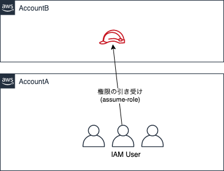

以下のエントリで記載したように、AWS 上においてはマルチアカウントで環境を構成することがベストプラクティスとされています。

[https://kiririmode.hatenablog.jp/entry/20200506/1588706829:embed]

このエントリでは、Custodian アカウントという概念が登場しました。これは結局 IAM ユーザやグループを1つのアカウントにのみ
定義し、他のアカウントには定義しないというアプローチです。他のアカウントには IAM ロールを定義し、各 IAM ユーザは assume-role 
することにより、他アカウントのロールを引き受けます。



では、Terraform 実行ユーザが Account A で定義されていたとして、Account B のリソースを Terraform で管理するにはどのようにすれば良いでしょうか。

## 戦略

Terraform の AWS Provider には、`provider "aws"` のブロックに [`assume_role` を記述](https://www.terraform.io/docs/providers/aws/index.html#assume-role)可能です。これにより、terraform を実行する際、「どの IAM Role を使うのか」を定義できます。

```hcl
provider "aws" {
  assume_role {
    role_arn     = "arn:aws:iam::ACCOUNT_ID:role/ROLE_NAME"
    session_name = "SESSION_NAME"
    external_id  = "EXTERNAL_ID"
  }
}
```

つまり Terraform の実行ユーザが Account A 上で定義されていたとしても、当該ユーザが「実行ユーザが、Account B 上のリソースを操作できる Role を assume-role」できれば良い。

## Account B 上でのロール定義

まず最初に、Account B 上で Terraform 実行用のロールを定義します。
どのようなロールにするのかは誰もが悩んでいることだと思いますが、ここでは `AdministratorAccess` ポリシーを割り当てました。そしてこの Role を、Account A のユーザにのみ assume-role できるように principals を設定します。

下記の実装においては、principals に `"arn:aws:iam::[AccountA ID]:user/[Terraform実行ユーザ]"` という値を設定することになるでしょう。

```hcl
# Terraform実行用Role
resource "aws_iam_role" "execution" {
  name               = "TerraformExecutionRole"
  assume_role_policy = data.aws_iam_policy_document.cross_account_assume_role.json
}

resource "aws_iam_role_policy_attachment" "execution" {
  role       = aws_iam_role.execution.name
  policy_arn = "arn:aws:iam::aws:policy/AdministratorAccess"
}

# Terraform実行ユーザにのみ移譲するassume role policy
data "aws_iam_policy_document" "cross_account_assume_role" {
  statement {
    actions = [
      "sts:AssumeRole",
    ]
    principals {
      type        = "AWS"
      identifiers = var.principals
    }
  }
}
```

## Account A の Terraform 実行ユーザが実行ロールを引き受けられるようにする

上記で定義した Account B の実行ロールを、Account A のユーザで引き受けられるようにします。
これで、Account A の Terraform 実行ユーザが、Account B の実行ロールを assume できるようになりました。

```hcl
# 各Runtime環境毎のTerraform実行ロールへのassume-role設定
data "aws_iam_policy_document" "assume_role" {
  statement {
    actions = [
      "sts:AssumeRole",
    ]
    resources = [
      [Account B上のTerraform実行ロールのARN]
    ]
  }
}

resource "aws_iam_policy" "assume_role" {
  description = "Allow Terraform Eexecution on Account B"
  name        = "AccountBTerraformAssumeRolePolicy"
  policy      = data.aws_iam_policy_document.assume_role.json
}

resource "aws_iam_user_policy_attachment" "assume_role" {
  user       = var.terraformer_name
  policy_arn = aws_iam_policy.assume_role.arn
}
```

## Terraform の実行

あとは、`main.tf` に以下のように記述しておけば、Account A のユーザのアクセスキーでアカウント B のリソースを Terraform 管理できるようになります。

```hcl
terraform {
  required_version = "0.12.28"

  backend "s3" {
    (snip)
  }
}

provider "aws" {
  assume_role {
    # アカウント B 上で定義した Terraform 実行ロール
    role_arn = "arn:aws:iam::[Account BのID]:role/TerraformExecutionRole"
  }
}
```
