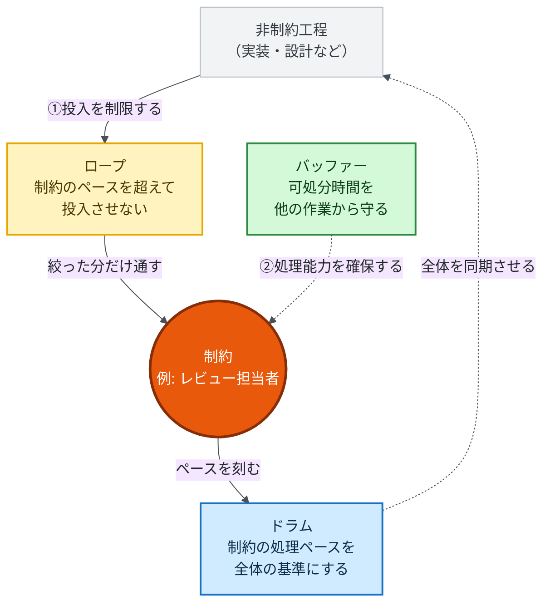

設計に関する質問だけが増えていって、回答が追いつかない。レビュー依頼の数だけはどんどん増えて、レビュー待ちの列も一緒に伸びていく。
こうなる理由は単純です。生成AIでどれだけ設計や実装を量産しても、レビューや意思判断という希少なキャパシティを守らなければ、開発チームの生産性は上がりません。

生成AIが実装のスピードを大きく引き上げた一方で、レビューや意思判断のスピードは変わっていません。だとすれば、「AIで成果物をばんばん生やして意味あるの？　生成自体が目的化してない？」という危機感を持たずにいるのは難しい。

ぼくは、DevOpsを学んでいたとき、制約理論（Theory of Constraints; ToC）という枠組みに出会いました。あらためてこのTOCの内容を理解し直し、自分の中で使える判断軸を作っておきたいと思い、ToCの原点たる、The Goalを読みました。

ISBN:978-4478420409:detail

ASIN:B079DL362C:details

[:contents]

# ボトルネックより速い工程をいくら鍛えても、全体のスループットは変わらない

TOCは、システム全体の生産速度は、その中で最も処理能力の低い工程によって決まる、という考え方です。この最も処理能力の低い工程のことを、TOCでは制約(constraint)、あるいはボトルネックと呼びます。呼び方も、3つ決まっています。お金を生み出す速度がスループット、まだお金に変わっていない仕掛かりが在庫、それを維持する費用が業務費用。動いているのは、いつもスループットです。
TOCの主張はシンプルで、制約以外の工程をいくら鍛えてもスループットは増えない。それどころか、非制約の工程の速度を上げるほど、「制約」の手前に「仕掛かり」が積み上がり、在庫と業務費用だけが増えてキャッシュフローを悪化させます。システム開発においては、大量のレビュー依頼が最たる例でしょう。急いだつもりが、損をしている。

> [https://www.goldratt.co.jp/about-toc:title]より引用

フォードや大野耐一が、すべてのリソースを100％稼働させるべきだという通念にあえて逆らったのも、同じ理屈からです。プロジェクトの全員を忙しくさせたって、スループットは上がらないどころか害にすらなり得る。このため、制約以外の工程・リソースを遊ばせておくのは、意図された判断であることが少なくありません。

TOCはこの原理から、5段階の手順を導きます。これを5 Focusing Steps(5つの集中ステップ)と呼びます。

1. 制約を見つける
2. 制約を徹底的に活用する
3. 他のすべての工程を制約に従属させる
4. 制約そのものの能力を高める
5. 新たな工程が制約になったら、最初に戻る

[https://speakerdeck.com/recruitengineers/fy2026_bootcamp_uejima?slide=31:embed]

核心は3番目の「他を従属させる」です。制約でない工程を、制約の処理能力に合わせて調整して初めて、全体最適が実現します。

# AIによって、制約は実装工程からレビューと意思決定へ移った

生成AIによって、実装工程の処理能力は桁違いに上がりました。一方、検証や意思決定といった他の工程の速度は、残念ながらほとんど変わっていません。非対称の行き着く先は決まっています。ボトルネックは、実装の中から、荷物（未検証のコード）だけを置いてレビューと意思決定へ引っ越していく。

ここで見落とされがちなのが、未検証のまま積み上がったAI生成物の扱いです。レビューされていないコードは、まだ価値に変わっていない仕掛かりであり、TOCでいう在庫そのものです。在庫は、静かに膨らみます。実装を速くする取り組みそのものが、在庫と業務費用を増やし、かえってフローを悪化させかねない。

では、制約がレビューや意思決定に移ったと分かったとき、何をすればよいのでしょうか。

# ボトルネックは「見つける」だけでは片手落ちで、「守る」運用まで要る

多くの場所で起きているのは、「レビュー担当者の処理能力が足りない」という事実が共有されて終わり、という展開ではないでしょうか。本来は稀有な「レビューできるだけの知識と技術を持った人間」（制約）を守るところまでは、話が及びません。

「守る」とは、まず、「制約」の処理能力を超えて他の工程が仕事を投入し続けないよう、投入量を制限することです。同時に、制約となった担当者や工程の可処分時間を、優先度の低い作業に奪われないよう確保することでもあります。投入を制限しながら、制約の処理能力を確保する。この2つを継続的に運用して初めて、生産性向上策は機能します。あるいは、根本的に「制約」を外注するなどして処理能力自体を底上げするか。まぁ書くのは簡単ですね、書くのは。

## Drum-Buffer-Rope: 制約のペースを基準に、投入を絞り、余裕を持たせる

この2つの手当てを具体的な設計に落とし込んだものが、ドラム・バッファー・ロープ(DBR、Drum-Buffer-Rope)と呼ばれる生産管理の手法です。DBRは3つの要素で構成されます。

- ドラム: 制約工程の処理ペースを、システム全体の基準にする
- バッファー: 制約が仕事切れで止まらないよう、時間的な余裕を持たせる
- ロープ: 制約のペースを超えて、上流から仕事を投入しない

図にすると、次のような循環になります。

（1）のロープが「投入を制限する」側、（2）のバッファーが「処理能力を確保する」側にあたります。ドラムが刻むペースは、上流の投入量を決める基準に戻ります。DBRは、この3要素で回るフィードバックループです。

この3要素は生産システムの設計にあたります。設計の上でどの仕事を優先して進めるか、DBRが実際に機能しているかを日々監視し制御するのが、バッファーマネジメントと呼ばれる運用です。設計と運用、この役割分担を押さえておくと見通しがよくなります。

## レビュー能力が1日5件なら、着手数をそこまで絞るしかない

DBRはソフトウェア開発のレビュー工程にもそのまま対応づけられます。考え方は単純で、たとえば、開発者が1日20件のPR(プルリクエスト)を実装でき、レビュー担当者が1日5件しか処理できないとします。このとき、ドラムはレビュー能力の1日5件、バッファーはレビュー待ちのPRを一定量確保しておくこと、ロープはレビュー能力を超えて実装に着手しないよう着手するPRの数を制限することにあたります。このロープは、アジャイル開発におけるKanban方式のWIP制限(WIP Limit、Work In Progress Limit)と発想が近いものです。

## 制約は動き続けるから、「守る」対象も見直し続けることになる

レビュー担当者を守る運用を一度設計しても、実装側の生産性がさらに上がれば、次に詰まるのは別の工程かもしれません。TOCではボトルネックを消すことではなく、意図的に推移させ続けることこそが計画力の本質だと考えます。「守り続ける」という営みには、制約を保護するだけでなく、制約の位置を観測し直すという意味も含まれています。

# AIで実装を大量生産すれば、本当にスループットは上がるのか

理屈はここまで。ここからは、ぼくの現場感覚です。

AIで実装量が増えた結果、レビューが回らなくなって、細部の指摘を諦めて通してしまう、という妥協を何度かしました。量産した実装が、結局レビュー待ちの山になる。そして、もっとも検証が雑になる。意味ないっすね。

もう1つ気になっているのが、意思判断のほうです。何かを判断しようと思っても、大量のレビューや、さまざまなコンテキストのインプットがないと、そもそも判断できないことがあります。実装を大量生産して判断材料だけを積み上げても、判断する側の処理能力が変わらなければ、その材料は在庫として滞留するだけです。

この状態でAIによる大量生産をさらに加速させたところで、本当にスループットは上がるのだろうか。率直に疑問を持っています。速いのは実装だけです。

# 最後に

大事なのは、制約に、正しい量の仕事を届け続けられるかどうかで決まります。ボトルネックを見つけたら、そこへの投入を制限しながら、処理能力を他の仕事から守る。この順番を踏まずに実装だけを加速させても、増えるのは仕掛かりと待ち時間だけです。

今のチームで、レビューか意思判断のどちらかが、すでに詰まっていないでしょうか。その問いへの答えが、次にAIをどこへ投資すべきかを教えてくれます。

# 参考文献

- [https://qiita.com/kotauchisunsun/items/f229a191c4ca99b82057:title:bookmark]
- [https://speakerdeck.com/recruitengineers/fy2026_bootcamp_uejima:title:bookmark]
- [全体最適のマネジメント理論 TOCゆとりを創り、生産性を飛躍的に向上させ、人を創る「働き方改革」](https://www.goldratt.co.jp/_files/ugd/a1e2e0_5394a79d70184973857e45ad1955f4e1.pdf)
- [https://blog.takaumada.com/entry/ai-organization-flow:title:bookmark]
- [https://note.com/suthio/n/n45a179642d7d#9d7a888b-9f9f-4917-8682-a34c60d71cd2:title:bookmark]
