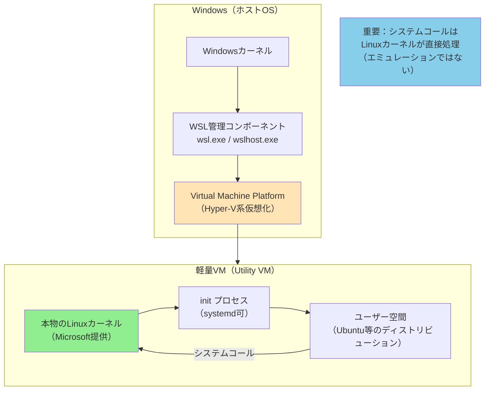
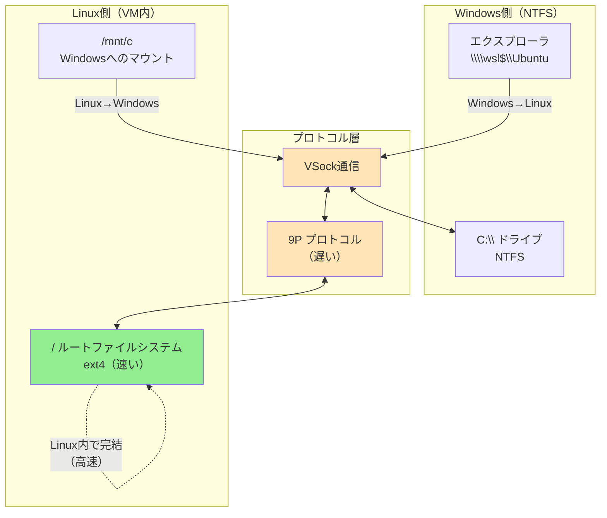

Claude CodeやCursorのようなコーディングエージェントが当たり前になってきました。これらのツールは、UNIX系のコマンドラインツールと組み合わせることで最大限の力を発揮します。grep、sed、find、git。これらのツールがシームレスに使える環境こそ、AIエージェントの本領発揮の場です。だから、Windows開発者もWSL2を使うべきだと考えています。

ところが、です。

「WSL2でフロントエンド開発しているけど、npm installが遅い」。こういう悩みをよく聞きます。原因は実はシンプルで、Windows側のファイルシステムに開発資材を置いているからです。

WSL2は軽量VMとして隔離されたアーキテクチャです。Windows⇔Linux間のファイルアクセスには9Pプロトコルが介在し、思った以上にオーバーヘッドがかかります。今日は、このあたりの仕組みを掘り下げて、なぜWSL2上のファイルシステムに資材を配置すべきと思っているのかを書きます。

一応、それが公式推奨でもある。

> We recommend against working across operating systems with your files, unless you have a specific reason for doing so. For the fastest performance speed, store your files in the WSL file system if you are working in a Linux command line (Ubuntu, OpenSUSE, etc). If you're working in a Windows command line (PowerShell, Command Prompt), store your files in the Windows file system.
>
> <cite>[https://learn.microsoft.com/en-us/windows/wsl/filesystems:title]</cite>

[:contents]

# AIエージェントはなぜUNIX環境で輝くのか

Claude CodeやCursorは、コマンドラインツールを駆使してコードベースを探索します。ファイル検索にはgrep、パターンマッチにはsed、ファイル一覧にはfind。これらのツールは数十年にわたって磨かれ、テキスト処理の標準として君臨しています。

そして、これらのツールの真価は、パイプラインで組み合わせたときに発揮されます。標準入力を受け取り、処理して、標準出力に流す。このシンプルな思想が、複雑な処理を組み立てる基盤になっています。

```bash
# Claude Codeが実行するような典型的なコマンド例
grep -r "export function" src/ | wc -l
find . -name "*.test.ts" -exec grep -l "describe" {} \;
```

Windows PowerShellでも同等のことはできます。だけど、UNIX系ツールの成熟度とエコシステムの広さは圧倒的です。npmパッケージ、Dockerイメージ、CI/CDパイプライン。これらの多くはLinux環境を前提に設計されているように思います。

AIエージェントは、コマンドラインの魔法使いです。だから、魔法の杖が揃っている環境が必要なわけです。

# WSL2のアーキテクチャ：軽量VMという現実

WSL2の正体は、Hyper-Vベースの軽量VM（Utility VM）です。その中で、本物のLinuxカーネルが動いています。

これはWSL1との決定的な違いです。WSL1はシステムコール翻訳レイヤーでした。Linuxのシステムコールを受け取って、WindowsカーネルのNT APIに翻訳していたわけです。一方、WSL2では本物のLinuxカーネルがシステムコールを直接処理します。

この違いは、互換性に大きく影響します。WSL1では一部のシステムコールが未実装でしたが、WSL2ではLinuxカーネルそのものが動くため、ほぼ完全な互換性を実現しています。Dockerも、systemdも、問題なく動きます。

しかし、軽量だからといって、VMであることに変わりはありません。ダイエットコーラがコーラなのと同じです。起動が速くて、リソース消費が少ない。そして、Windows⇔Linux間には明確な境界が存在します。ネットワークスタックは分離されているし、ファイルシステムも分離されている。プロセス空間も当然別です。

つまり、WSL2は「別マシン」と考えたほうが、挙動を理解しやすくなります。



# Windows⇔Linux間のファイルアクセスと9Pプロトコル

WSL2のファイルシステムは二重構造です。Linux側はext4で、VHDXという仮想ディスクファイルに格納されています。一方、Windows側はNTFSです。

Linux側から`/mnt/c`でWindowsのCドライブにアクセスできます。逆に、Windows側から`\\wsl$\Ubuntu`でLinux側のファイルにアクセスできます。便利ですよね。

だけど、この相互アクセスには代償があります。

その代償の正体が、9P（Plan 9 Filesystem Protocol）です。これはPlan 9という分散OSに由来する、軽量なファイル共有プロトコルです。ネットワーク越しのファイルアクセスを想定して設計されています。

[https://wsl.dev/technical-documentation/plan9/embed]
[https://ericvh.github.io/9p-rfc/rfc9p2000.html:embed]

WSL2では、この9Pプロトコルを使ってWindows⇔Linux間のファイル操作を実現しています。通信経路としてはVSock（VMとホスト間の仮想ソケット）を使いますが、プロトコル自体はネットワーク越しを前提とした設計です。

なぜ遅いのか。理由はいくつかあります。

まず、VM境界を越える必要があります。ローカルファイルシステムならカーネル内で完結する操作が、VMを越えて通信しなければなりません。

次に、プロトコル変換のオーバーヘッドがあります。Linuxの1回のシステムコール（たとえば`open()`）が、9Pでは多くの場合、複数回のメッセージ往復に変換されます。

そして、メタデータアクセスが特に遅い。`stat()`でファイル属性を取得するだけでも、しばしば複数回の往復が発生します。`git status`や`find`のように大量のファイルを調べる操作は、この往復が積み重なって、体感できるほど遅くなります。

[https://vxlabs.com/2019/12/06/wsl2-io-measurements/:embed]

対照的に、Linux側で完結する操作はネイティブext4の速度で動きます。VM境界を越えないからです。

9Pを経由すると、数千個のnode_modulesファイルを相手にするには、ちょっと力不足なんです。

```bash
# Linux側（速い）
time find /home/user/project/node_modules -ls | wc -l

# Windows側経由（遅い）
time find /mnt/c/Users/user/project/node_modules -ls | wc -l
```



# 大量のファイルアクセスが発生する開発では特に遅い

ビルドシステムやパッケージマネージャは、ファイルシステムにとってのストレステストです。

フロントエンド開発で`npm install`を実行すると、node_modulesに数万個のファイルが作成されます。Rustで`cargo build`すると、依存関係を解決するために大量のメタデータアクセスが発生します。Pythonで仮想環境を構築する`venv`も、同様に多数の小ファイルを扱います。

これらの操作は、頻繁なメタデータアクセスを伴います。ファイルが存在するか確認し、属性を読み取り、ディレクトリを走査する。9Pプロトコルでは、これらの操作がそれぞれ複数回のメッセージ往復に変換されます。

実際の体験として、Windows側に配置したNode.jsプロジェクトをWSL2側から`npm install`を実行すると、10倍近く遅くなることがあります。同じ操作をLinux側で実行すれば、ネイティブext4の速度で完了します。

```bash
# Windows側に配置した場合（悪い例）
/mnt/c/Users/username/project/  # ❌ 遅い

# WSL2側に配置した場合（良い例）
/home/username/project/  # ✅ 速い
```

# 開発資材はどこに置くべきか

結論はシンプルです。WSL2上のファイルシステム（/home以下）に配置しましょう。

I/Oが頻繁に発生するプロジェクトは、Linux側で完結させることが原則です。Gitリポジトリ、ソースコード、ビルド成果物、依存関係（node_modules、target、venv等）。これらすべてをLinux側に置けば、VM境界を越えずにネイティブext4の速度で処理されます。

一方で、Windows側のツールを使いたい場合もあります。たとえば、Visual StudioやOfficeで開くドキュメントは、Windows側に置いたほうが扱いやすいでしょう。

だけど、開発の中心はLinux側です。そして、Windows側からLinux側のファイルにアクセスする方法も用意されています。

エクスプローラーで`\\wsl$\Ubuntu\home\username\projects`と入力すれば、Linux側のファイルが見えます。Windows側からWSL2のファイルを見たければ、`\\wsl$`というワープゲートがあります。魔法のようですが、これはちゃんと公式機能です。

さらに、VS Code Remote WSL拡張を使えば、エディタはWindows側で動かしながら、ファイルとプロセスはLinux側で扱えます。これがハイブリッド構成として最適です。エディタの快適さを保ちながら、I/O性能も確保できます。

```bash
# WSL2上での開発ディレクトリ作成
mkdir -p ~/projects/myapp
cd ~/projects/myapp
git clone https://github.com/user/repo.git .
npm install  # 高速！
```

```powershell
# WindowsからWSL2ファイルへアクセス
explorer.exe \\wsl$\Ubuntu\home\username\projects\myapp
```

# まとめ

AIエージェント時代、UNIX系ツールが使えるWSL2環境は重要です。だけど、ファイル配置場所を間違えると、開発体験が台無しになります。

WSL2は軽量VMですが、Windows⇔Linux間のファイルアクセスには9Pプロトコルが介在します。これがVM境界を越えるオーバーヘッドを生み、特に大量ファイルアクセスを伴う開発では顕著に遅くなります。1回のシステムコールが複数回のメッセージ往復に変換されるため、累積レイテンシが無視できないレベルになるわけです。

解決策はシンプルです。開発資材はWSL2上のファイルシステム（/home以下）に配置しましょう。Linux側で完結する操作はネイティブext4の速度で動きます。Windows側からアクセスしたければ、`\\wsl$`経由で見られます。VS Code Remote WSLを使えば、エディタはWindowsで快適に、I/Oは高速にという両立も可能です。
